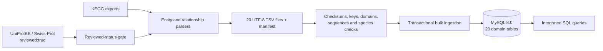

# UniKegg

## Overview & Engineering Objective

UniKegg integrates KEGG genes, orthology groups, pathways, reactions and compounds with **UniProtKB/Swiss-Prot exclusively** in MySQL. UniProtKB/TrEMBL records are excluded. The ETL separates acquisition, deterministic TSV transformation, validation and transactional relational ingestion.

Swiss-Prot is the protein reference set because its manually reviewed annotations provide a curated basis for protein identity, sequence metadata and functional interpretation. Acquisition explicitly requests `reviewed:true`; transformation rejects records whose `Reviewed` field is not `reviewed`. KEGG-to-protein mappings are retained only when both endpoints exist in the selected dataset. Manual review improves semantic reliability; it does **not** itself guarantee referential integrity. Primary keys, foreign keys, domain constraints and cross-organism validation enforce the relational contract.

The prepared local snapshot contains 10 organisms, 20 domain tables, 2,006,370 rows, 89,601 reviewed protein records and 200,249 KEGG genes. These figures describe this snapshot, not a guarantee about future upstream releases. Acquisition is optional and is never started by the demo.

## System Architecture & Database Schema

```text
UniKegg/
├── src/unikegg/
│   ├── acquire/              # Explicit KEGG and reviewed UniProt acquisition
│   ├── transforms/           # Existing entity and relationship parsers
│   ├── dataset.py            # Hashes, provenance and relational validation
│   ├── loader.py             # Transactional MySQL bulk ingestion
│   └── schema.json           # Machine-readable 20-table contract
├── db/
│   ├── init/                 # DDL applied to a new MySQL volume
│   ├── load/                 # Parameterized bulk-ingestion SQL
│   └── queries/              # 30 cross-resource SQL queries
├── data/
│   ├── raw/                  # Authorized upstream exports; ignored by Git
│   ├── processed/            # 20 TSV files and manifest; ignored by Git
│   └── manifests/            # Optional external provenance records; ignored
├── docs/                     # Architecture, ER diagram and operations
├── tests/                    # Synthetic fixture generator and contract tests
├── tools/                    # MySQL ingestion lint compatibility check
├── artifacts/                # Local execution reports; ignored by Git
├── .github/workflows/ci.yml
├── docker-compose.yml
├── Dockerfile
├── requirements.txt
└── requirements-dev.txt
```



The schema separates biological entities from many-to-many associations. `GENE_PROTEINA` is the principal KEGG/Swiss-Prot integration bridge and retains mapping provenance (`KEGG_CONV` or `UNIPROT_DR`). Reference pathways are distinct from organism-specific pathways. GO terms and EC identifiers are deduplicated dimensions. Isoforms reference canonical protein accessions. The existing SQL identifiers are preserved for compatibility; see the [logical schema and ER diagram](docs/schema.md).

An additional infrastructure table, `ETL_LOAD_STATE`, records the committed dataset fingerprint. It is not a biological domain table. Foreign-key checks remain enabled. The loader rejects MySQL warnings and rolls back uncommitted data on failure. A repeat load of the same manifest verifies the existing database; a different manifest or an unexplained nonempty database is rejected instead of overwritten.

TSVs use UTF-8, tab separators, LF line endings, optional double-quote enclosure and doubled internal quotes. Empty values become SQL `NULL` only in nullable fields. The ingestion SQL explicitly matches this format; it does not treat backslashes as escape characters. Canonical sequences use `MEDIUMTEXT` and must match their declared lengths.

## Infrastructure Setup (Docker Compose)

Install Docker Engine or Docker Desktop with the Compose v2 plugin. Use Linux containers. Run commands from this directory. Container images and Python dependencies require network access on the first build; biological data downloads are not required for the prepared demo. Allow approximately 4 GB of available memory and several GB of free disk space for images, the database and temporary build files; actual use depends on the runtime.

The two services are:

| Service | Role | Lifecycle |
|---|---|---|
| `mysql` | MySQL 8.0.44, persistent `mysql_data` volume, automatic DDL initialization | Long-running |
| `etl` | Python 3.12, validation and bulk ingestion, non-root user | Exits successfully after loading or verification |

The MySQL service is exposed on `127.0.0.1:3307`, avoiding an existing local server on port 3306. Its SQL health check authenticates as the application user and checks that initialization has created the load-state table. Compose starts ETL only after that check succeeds. Schema initialization runs only for an empty database volume, as defined by the [official MySQL image](https://hub.docker.com/_/mysql). Startup dependencies use [Compose health conditions](https://docs.docker.com/compose/how-tos/startup-order/).

`.env.example` lists the connection settings. Copy it to `.env` and change credentials when needed. Compose reads `.env` automatically. Without it, explicitly documented local-demo defaults are used: user `unikegg`, password `local-demo-only`, root password `local-root-demo-only`, database `UniKegg`. These are disposable demo credentials, not production secrets. Never expose this configuration directly to an external network. Changes to initialization credentials do not update accounts in an existing volume.

### Local Python environment

Python 3.11 or later is required; container and CI execution target Python 3.12.

```bash
python -m venv .venv
# POSIX: source .venv/bin/activate
# PowerShell: .\.venv\Scripts\Activate.ps1
python -m pip install -r requirements-dev.txt
python -m pip install --no-deps -e .
unikegg validate
ruff check src tests tools
sqlfluff lint db --dialect mysql
python tools/lint_ingest.py
pytest -q
```

For runtime-only use, install `requirements.txt` instead. The local CLI reads environment variables, not `.env` files. Explicit download commands are `unikegg download-uniprot` and `unikegg download-kegg`; append `--dry-run` to inspect requests without contacting the upstream APIs. Run `unikegg transform` only after authorized raw exports are available under `data/raw/`. See [operations](docs/operations.md) for source layout, manifest generation and failure handling.

GitHub Actions runs Ruff, SQLFluff with the MySQL dialect and unit tests, then starts both Compose services on an ephemeral runner. Integration uses invented fixtures covering all 20 domain tables and 10 organism codes. It tests automatic initialization, successful loading, verification and a repeated load. It does not download or publish upstream datasets.

## Quickstart / Demo Environment

For the prepared local distribution, `data/processed/` already contains the 20 real TSV files and their validated manifest. Start the complete offline-data demo with:

```bash
docker compose up --build
```

`docker-compose up --build` is the equivalent spelling when the standalone compatible command is installed. No acquisition command is required. Wait for ETL to emit `"event": "ready"` with `"action": "loaded"` and exit with code 0. MySQL remains running and queryable. Loading this snapshot can take several minutes; existing data avoids download time, not ingestion time. Use `docker compose up --build -d` for detached operation and `docker compose logs -f etl` to inspect progress.

Verify the committed dataset and connect interactively:

```bash
docker compose run --rm etl verify
docker compose exec mysql mysql -uunikegg -p UniKegg
```

Enter the configured application password at the prompt. Execute:

```sql
SELECT COUNT(*) AS organisms FROM ORGANISMO;
SELECT COUNT(*) AS reviewed_proteins FROM PROTEIN_UNIPROT;
SELECT COUNT(*) AS invalid_sequences
FROM PROTEIN_UNIPROT
WHERE CHAR_LENGTH(amino_acid_sequence) <> sequence_length;

SELECT o.kegg_code, COUNT(DISTINCT gp.accession) AS mapped_reviewed_proteins
FROM ORGANISMO AS o
INNER JOIN GENE_KEGG AS g ON g.organism_id = o.organism_id
INNER JOIN GENE_PROTEINA AS gp ON gp.kegg_gene_id = g.kegg_gene_id
INNER JOIN PROTEIN_UNIPROT AS p ON p.accession = gp.accession
GROUP BY o.kegg_code
ORDER BY o.kegg_code;
```

Expected prepared-snapshot results are 10 organisms, 89,601 reviewed proteins and zero invalid sequence lengths. `COUNT(DISTINCT ...)` avoids double-counting a mapping reported by both sources. Additional read-only queries are mounted inside MySQL at `/queries/integration.sql`; execute `SOURCE /queries/integration.sql;` in its interactive client. Query results describe integrated annotations, not experimentally demonstrated activity.

### Public-clone behavior

Real TSVs, upstream exports and SQL dumps are deliberately excluded from Git. A public clone therefore does **not** contain the real snapshot. Supply an authorized 20-file bundle with its `manifest.json` under `data/processed/`, then run the same Compose command. A missing or mismatched manifest fails explicitly. Do not manufacture a Swiss-Prot declaration for unverified data.

For an upstream-independent smoke test from a public clone, generate explicitly synthetic data after installing the Python package:

```bash
python tests/make_fixture.py
```

Set these values in `.env`, then run `docker compose up --build` using a **separate Compose project and free port** if the real demo already exists:

```dotenv
UNIKEGG_PROCESSED_DIR=./tests/fixtures/processed
UNIKEGG_DATASET_KIND=synthetic
COMPOSE_PROJECT_NAME=unikegg-synthetic
MYSQL_PORT=3308
```

This fixture has 10 invented protein records. It is neither a Swiss-Prot export nor a substitute for biological validation. Real and synthetic modes cannot silently overwrite each other. `docker compose down` stops the services while preserving database storage; do not add `--volumes` unless intentionally discarding that project's database.

## Data Governance & Upstream Licenses

KEGG and UniProt are independent upstream resources. Their terms apply to the underlying records regardless of this repository's implementation. KEGG material is not included in the public Git tree; obtaining API access does not automatically grant redistribution rights. Check the [KEGG legal notice](https://www.kegg.jp/kegg/legal.html) and [licensing conditions](https://kegg.net/en/licensing.html) for the intended use before acquiring, sharing or publishing raw files, processed TSVs, database dumps or container images that contain records.

UniProt states that copyrightable database content is available under CC BY 4.0; retain attribution and indicate relevant transformations, as described in the [UniProt data policy](https://www.uniprot.org/api-documentation/support-data). Filtering to UniProtKB/Swiss-Prot does not remove these obligations. UniKegg preserves accessions and source-specific mapping labels; it does not claim ownership of upstream annotations.

The processed manifest records file hashes, row counts and the reviewed-only declaration established by accession comparison with a reviewed upstream export. SHA-256 checks detect changes relative to that manifest; they are not a digital signature or independent proof of biological correctness. Keep the corresponding raw snapshot, acquisition metadata and applicable permissions with any privately distributed dataset. Public CI uses synthetic data and makes no upstream API calls. See [data governance](docs/data-governance.md) for scope and limitations.
