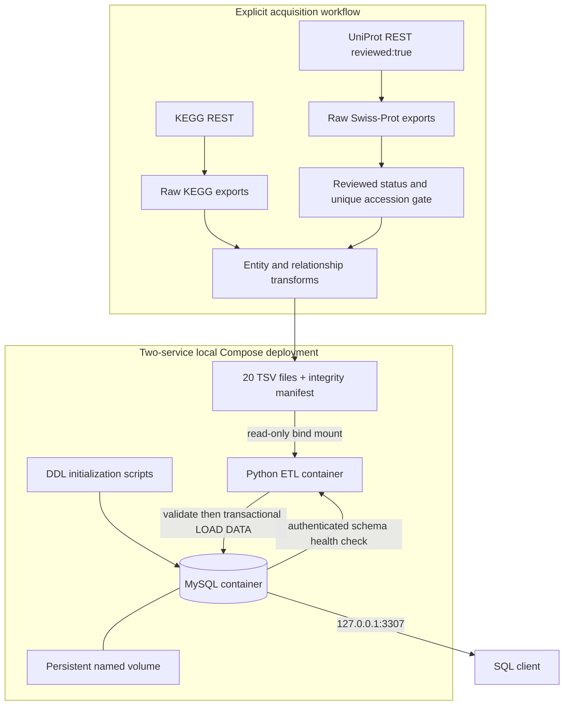

# Architecture

The offline demo begins at the processed dataset, not at upstream acquisition. The MySQL initializer owns schema creation. The Python service owns data validation and ingestion. A successful ETL exit does not stop the database. Container lifecycle and dataset identity are independent: persistent data is retained across container replacement, and an existing load-state fingerprint prevents silent replacement with another snapshot.

The SQL health check establishes schema readiness, not dataset readiness. Consumers must wait for the ETL `ready` event or require successful `unikegg verify` before querying a complete snapshot. Failed imports are rolled back. The application has no database root password and local-file reads are limited to a private, checksum-validated transport snapshot. Subsequent changes to the host bundle cannot change the bytes supplied to SQL. The snapshot is removed after success or failure.

The default topology is an isolated demonstration environment. Production operation requires separately designed secret handling, authentication and authorization, encrypted connections, backup/restore policies, migrations, observability and capacity planning.
