# Logical schema

```mermaid
erDiagram
    ORGANISMO {
        int organism_id PK
        varchar kegg_code
        int taxonomy_id
        varchar scientific_name
    }
    ORTOLOGIA_KEGG {
        char ko_id PK
        varchar name
        text definition
    }
    PATHWAY_RIFERIMENTO {
        char map_id PK
        varchar name
    }
    REAZIONE_KEGG {
        char reaction_id PK
        text name
        text definition
        text equation
    }
    COMPOSTO_KEGG {
        char compound_id PK
        text name
        varchar formula
        decimal exact_mass
        decimal molecular_weight
    }
    TERMINE_GO {
        char go_id PK
        varchar name
        enum namespace
    }
    NUMERO_EC {
        varchar ec_number PK
    }
    GENE_KEGG {
        varchar kegg_gene_id PK
        int organism_id FK
        varchar gene_type
        varchar symbol
        text definition
    }
    PROTEIN_UNIPROT {
        varchar accession PK
        int organism_id FK
        varchar entry_name
        text protein_name
        int sequence_length
        int molecular_mass
        varchar protein_existence
        int sequence_version
        mediumtext amino_acid_sequence
    }
    PATHWAY_ORGANISMO {
        varchar pathway_id PK
        int organism_id FK
        char map_id FK
    }
    PROTEIN_ISOFORM {
        varchar isoform_id PK
        varchar accession FK
        int ordinal
        varchar name
        enum sequence_status
        text note
    }
    GENE_PROTEINA {
        varchar kegg_gene_id PK,FK
        varchar accession PK,FK
        enum mapping_source PK
    }
    GENE_ORTOLOGIA {
        varchar kegg_gene_id PK,FK
        char ko_id PK,FK
    }
    GENE_PATHWAY {
        varchar kegg_gene_id PK,FK
        varchar pathway_id PK,FK
    }
    ORTOLOGIA_REAZIONE {
        char ko_id PK,FK
        char reaction_id PK,FK
    }
    PATHWAY_REAZIONE {
        char map_id PK,FK
        char reaction_id PK,FK
    }
    REAZIONE_COMPOSTO {
        char reaction_id PK,FK
        char compound_id PK,FK
    }
    PROTEINA_GO {
        varchar accession PK,FK
        char go_id PK,FK
        varchar evidence_code
        varchar evidence_source
    }
    PROTEINA_EC {
        varchar accession PK,FK
        varchar ec_number PK,FK
    }
    REAZIONE_EC {
        char reaction_id PK,FK
        varchar ec_number PK,FK
    }
    ORGANISMO ||--o{ GENE_KEGG : "organism_id"
    ORGANISMO ||--o{ PROTEIN_UNIPROT : "organism_id"
    ORGANISMO ||--o{ PATHWAY_ORGANISMO : "organism_id"
    PATHWAY_RIFERIMENTO ||--o{ PATHWAY_ORGANISMO : "map_id"
    PROTEIN_UNIPROT ||--o{ PROTEIN_ISOFORM : "accession"
    GENE_KEGG ||--o{ GENE_PROTEINA : "kegg_gene_id"
    PROTEIN_UNIPROT ||--o{ GENE_PROTEINA : "accession"
    GENE_KEGG ||--o{ GENE_ORTOLOGIA : "kegg_gene_id"
    ORTOLOGIA_KEGG ||--o{ GENE_ORTOLOGIA : "ko_id"
    GENE_KEGG ||--o{ GENE_PATHWAY : "kegg_gene_id"
    PATHWAY_ORGANISMO ||--o{ GENE_PATHWAY : "pathway_id"
    ORTOLOGIA_KEGG ||--o{ ORTOLOGIA_REAZIONE : "ko_id"
    REAZIONE_KEGG ||--o{ ORTOLOGIA_REAZIONE : "reaction_id"
    PATHWAY_RIFERIMENTO ||--o{ PATHWAY_REAZIONE : "map_id"
    REAZIONE_KEGG ||--o{ PATHWAY_REAZIONE : "reaction_id"
    REAZIONE_KEGG ||--o{ REAZIONE_COMPOSTO : "reaction_id"
    COMPOSTO_KEGG ||--o{ REAZIONE_COMPOSTO : "compound_id"
    PROTEIN_UNIPROT ||--o{ PROTEINA_GO : "accession"
    TERMINE_GO ||--o{ PROTEINA_GO : "go_id"
    PROTEIN_UNIPROT ||--o{ PROTEINA_EC : "accession"
    NUMERO_EC ||--o{ PROTEINA_EC : "ec_number"
    REAZIONE_KEGG ||--o{ REAZIONE_EC : "reaction_id"
    NUMERO_EC ||--o{ REAZIONE_EC : "ec_number"
```

Twenty domain tables are shown. `ETL_LOAD_STATE` is operational metadata and is intentionally outside the biological ER diagram.

## Relation grain and constraints

| Relation | Primary key | Meaning |
|---|---|---|
| `ORGANISMO` | `organism_id` | Selected organism or strain |
| `ORTOLOGIA_KEGG` | `ko_id` | KEGG orthology group |
| `PATHWAY_RIFERIMENTO` | `map_id` | Reference pathway map |
| `REAZIONE_KEGG` | `reaction_id` | KEGG reaction |
| `COMPOSTO_KEGG` | `compound_id` | KEGG compound |
| `TERMINE_GO` | `go_id` | GO term |
| `NUMERO_EC` | `ec_number` | EC identifier |
| `GENE_KEGG` | `kegg_gene_id` | KEGG gene |
| `PROTEIN_UNIPROT` | `accession` | Reviewed canonical protein and sequence |
| `PATHWAY_ORGANISMO` | `pathway_id` | Organism-specific pathway |
| `PROTEIN_ISOFORM` | `isoform_id` | Isoform metadata |
| `GENE_PROTEINA` | `kegg_gene_id, accession, mapping_source` | Gene/protein mapping per source |
| `GENE_ORTOLOGIA` | `kegg_gene_id, ko_id` | Gene/orthology assignment |
| `GENE_PATHWAY` | `kegg_gene_id, pathway_id` | Gene/pathway membership |
| `ORTOLOGIA_REAZIONE` | `ko_id, reaction_id` | Orthology/reaction association |
| `PATHWAY_REAZIONE` | `map_id, reaction_id` | Reference pathway/reaction membership |
| `REAZIONE_COMPOSTO` | `reaction_id, compound_id` | Reaction/compound association |
| `PROTEINA_GO` | `accession, go_id` | Protein/GO annotation |
| `PROTEINA_EC` | `accession, ec_number` | Protein/EC assignment |
| `REAZIONE_EC` | `reaction_id, ec_number` | Reaction/EC assignment |

All foreign-key endpoints and column types are shown above. A parent can have zero or many child records; every stored child reference targets one parent. Composite primary keys make bridge relationships unique at their declared grain.

Additional unique keys are `ORGANISMO.kegg_code`, `ORGANISMO.taxonomy_id`, `PROTEIN_UNIPROT.entry_name`, `PATHWAY_ORGANISMO(organism_id, map_id)` and `PROTEIN_ISOFORM(accession, ordinal)`. For newly transformed isoforms, `ordinal` is the numeric IsoId suffix within the stored parent accession, not the block position in an External citation. Metadata from the parent entry wins over external citations; ties are resolved deterministically. Nullable attributes represent unavailable annotations, not fabricated values. The DDL in `db/init/001_schema.sql` is the executable authority for types, checks, delete behavior and indexes.

The principal integration traversal is `ORGANISMO → GENE_KEGG → GENE_PROTEINA → PROTEIN_UNIPROT`. The same gene links to KEGG orthology and pathway dimensions, while the protein links to GO and EC dimensions. Reaction-level integration can traverse orthology/reaction mappings or EC assignments; these paths encode different source assertions and should not be treated as interchangeable evidence.

