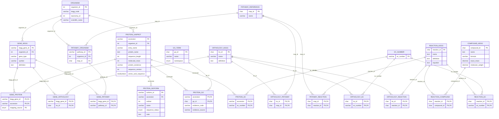

# Logical schema

For installations with previous Italian table or TSV names, first follow the [English naming migration](english-names-migration.md).

```mermaid
erDiagram
    ORGANISM {
        int organism_id PK
        varchar kegg_code
        int taxonomy_id
        varchar scientific_name
    }
    ORTHOLOGY_KEGG {
        char ko_id PK
        varchar name
        text definition
    }
    PATHWAY_REFERENCE {
        char map_id PK
        varchar name
    }
    REACTION_KEGG {
        char reaction_id PK
        text name
        text definition
        text equation
    }
    COMPOUND_KEGG {
        char compound_id PK
        text name
        varchar formula
        decimal exact_mass
        decimal molecular_weight
    }
    GO_TERM {
        char go_id PK
        varchar name
        enum namespace
    }
    EC_NUMBER {
        varchar ec_number PK
    }
    GENE_KEGG {
        varchar kegg_gene_id PK
        int organism_id FK
        varchar gene_type
        varchar symbol
        text definition
    }
    PROTEIN_UNIPROT {
        varchar accession PK
        int organism_id FK
        varchar entry_name
        text protein_name
        int sequence_length
        int molecular_mass
        varchar protein_existence
        int sequence_version
        mediumtext amino_acid_sequence
    }
    PATHWAY_ORGANISM {
        varchar pathway_id PK
        int organism_id FK
        char map_id FK
    }
    PROTEIN_ISOFORM {
        varchar isoform_id PK
        varchar accession FK
        int ordinal
        varchar name
        enum sequence_status
        text note
    }
    GENE_PROTEIN {
        varchar kegg_gene_id PK,FK
        varchar accession PK,FK
        enum mapping_source PK
    }
    GENE_ORTHOLOGY {
        varchar kegg_gene_id PK,FK
        char ko_id PK,FK
    }
    GENE_PATHWAY {
        varchar kegg_gene_id PK,FK
        varchar pathway_id PK,FK
    }
    ORTHOLOGY_PATHWAY {
        char ko_id PK,FK
        char map_id PK,FK
    }
    ORTHOLOGY_EC {
        char ko_id PK,FK
        varchar ec_number PK,FK
    }
    ORTHOLOGY_REACTION {
        char ko_id PK,FK
        char reaction_id PK,FK
    }
    PATHWAY_REACTION {
        char map_id PK,FK
        char reaction_id PK,FK
    }
    REACTION_COMPOUND {
        char reaction_id PK,FK
        char compound_id PK,FK
    }
    PROTEIN_GO {
        varchar accession PK,FK
        char go_id PK,FK
        varchar evidence_code
        varchar evidence_source
    }
    PROTEIN_EC {
        varchar accession PK,FK
        varchar ec_number PK,FK
    }
    REACTION_EC {
        char reaction_id PK,FK
        varchar ec_number PK,FK
    }
    ORGANISM ||--o{ GENE_KEGG : "organism_id"
    ORGANISM ||--o{ PROTEIN_UNIPROT : "organism_id"
    ORGANISM ||--o{ PATHWAY_ORGANISM : "organism_id"
    PATHWAY_REFERENCE ||--o{ PATHWAY_ORGANISM : "map_id"
    PROTEIN_UNIPROT ||--o{ PROTEIN_ISOFORM : "accession"
    GENE_KEGG ||--o{ GENE_PROTEIN : "kegg_gene_id"
    PROTEIN_UNIPROT ||--o{ GENE_PROTEIN : "accession"
    GENE_KEGG ||--o{ GENE_ORTHOLOGY : "kegg_gene_id"
    ORTHOLOGY_KEGG ||--o{ GENE_ORTHOLOGY : "ko_id"
    GENE_KEGG ||--o{ GENE_PATHWAY : "kegg_gene_id"
    PATHWAY_ORGANISM ||--o{ GENE_PATHWAY : "pathway_id"
    ORTHOLOGY_KEGG ||--o{ ORTHOLOGY_PATHWAY : "ko_id"
    PATHWAY_REFERENCE ||--o{ ORTHOLOGY_PATHWAY : "map_id"
    ORTHOLOGY_KEGG ||--o{ ORTHOLOGY_EC : "ko_id"
    EC_NUMBER ||--o{ ORTHOLOGY_EC : "ec_number"
    ORTHOLOGY_KEGG ||--o{ ORTHOLOGY_REACTION : "ko_id"
    REACTION_KEGG ||--o{ ORTHOLOGY_REACTION : "reaction_id"
    PATHWAY_REFERENCE ||--o{ PATHWAY_REACTION : "map_id"
    REACTION_KEGG ||--o{ PATHWAY_REACTION : "reaction_id"
    REACTION_KEGG ||--o{ REACTION_COMPOUND : "reaction_id"
    COMPOUND_KEGG ||--o{ REACTION_COMPOUND : "compound_id"
    PROTEIN_UNIPROT ||--o{ PROTEIN_GO : "accession"
    GO_TERM ||--o{ PROTEIN_GO : "go_id"
    PROTEIN_UNIPROT ||--o{ PROTEIN_EC : "accession"
    EC_NUMBER ||--o{ PROTEIN_EC : "ec_number"
    REACTION_KEGG ||--o{ REACTION_EC : "reaction_id"
    EC_NUMBER ||--o{ REACTION_EC : "ec_number"
```

Twenty-two domain tables are shown. `ETL_LOAD_STATE` and `ETL_DATASET_HISTORY` are operational metadata outside the biological ER diagram. `ETL_LOAD_STATE.current_version` identifies the currently committed version. History stores sequential versions, UTC timestamps, fingerprints, labels, manifests and logical change counts; see [dataset updates](updates.md).

## Relation grain and constraints

| Relation | Primary key | Meaning |
|---|---|---|
| `ORGANISM` | `organism_id` | Selected organism or strain |
| `ORTHOLOGY_KEGG` | `ko_id` | KEGG orthology group |
| `PATHWAY_REFERENCE` | `map_id` | Reference pathway map |
| `REACTION_KEGG` | `reaction_id` | KEGG reaction |
| `COMPOUND_KEGG` | `compound_id` | KEGG compound |
| `GO_TERM` | `go_id` | GO term |
| `EC_NUMBER` | `ec_number` | EC identifier |
| `GENE_KEGG` | `kegg_gene_id` | KEGG gene |
| `PROTEIN_UNIPROT` | `accession` | Reviewed canonical protein and sequence |
| `PATHWAY_ORGANISM` | `pathway_id` | Organism-specific pathway |
| `PROTEIN_ISOFORM` | `isoform_id` | Isoform metadata |
| `GENE_PROTEIN` | `kegg_gene_id, accession, mapping_source` | Gene/protein mapping per source |
| `GENE_ORTHOLOGY` | `kegg_gene_id, ko_id` | Gene/orthology assignment |
| `GENE_PATHWAY` | `kegg_gene_id, pathway_id` | Gene/pathway membership |
| `ORTHOLOGY_PATHWAY` | `ko_id, map_id` | Direct KO/reference pathway membership |
| `ORTHOLOGY_EC` | `ko_id, ec_number` | Direct KO/EC assignment |
| `ORTHOLOGY_REACTION` | `ko_id, reaction_id` | Orthology/reaction association |
| `PATHWAY_REACTION` | `map_id, reaction_id` | Reference pathway/reaction membership |
| `REACTION_COMPOUND` | `reaction_id, compound_id` | Reaction/compound association |
| `PROTEIN_GO` | `accession, go_id` | Protein/GO annotation |
| `PROTEIN_EC` | `accession, ec_number` | Protein/EC assignment |
| `REACTION_EC` | `reaction_id, ec_number` | Reaction/EC assignment |

All foreign-key endpoints and column types are shown above. A parent can have zero or many child records; every stored child reference targets one parent. Composite primary keys make bridge relationships unique at their declared grain.

Additional unique keys are `ORGANISM.kegg_code`, `ORGANISM.taxonomy_id`, `PROTEIN_UNIPROT.entry_name`, `PATHWAY_ORGANISM(organism_id, map_id)` and `PROTEIN_ISOFORM(accession, ordinal)`. For newly transformed isoforms, `ordinal` is the numeric IsoId suffix within the stored parent accession, not the block position in an External citation. Metadata from the parent entry wins over external citations; ties are resolved deterministically. Nullable attributes represent unavailable annotations, not fabricated values. The DDL in `db/init/001_schema.sql` is the executable authority for types, checks, delete behavior and indexes.

The principal integration traversal is `ORGANISM → GENE_KEGG → GENE_PROTEIN → PROTEIN_UNIPROT`. The same gene links to KEGG orthology and pathway dimensions, while the protein links to GO and EC dimensions. Reaction-level integration can traverse orthology/reaction mappings or EC assignments; these paths encode different source assertions and should not be treated as interchangeable evidence.

The curated acquisition catalog uses distinct UniProt taxids and preserves the existing unique constraints; no SQL migration is required. `ORGANISM.taxonomy_id` is the UniProt query taxid, which may differ from the KEGG genome taxid for explicit curated scope aliases. Local IDs remain stable even for a subset. The processed manifest declares the selected codes; legacy manifests without that declaration retain the ten-organism contract.

The two KO bridges use InnoDB, composite primary keys, non-null foreign keys and reverse-lookup indexes (`map_id`, `ec_number`). `ON DELETE RESTRICT ON UPDATE RESTRICT` protects reference catalogs; synchronization removes dependent links before changing parents. Participation is optional: KO groups need not have an EC or pathway annotation. Direct KO assertions are not inferred from reaction or protein links. `path:koNNNNN` and `path:mapNNNNN` normalize to `mapNNNNN`; species-specific pathways remain distinct. See the [migration and source semantics](orthology-migration.md).
